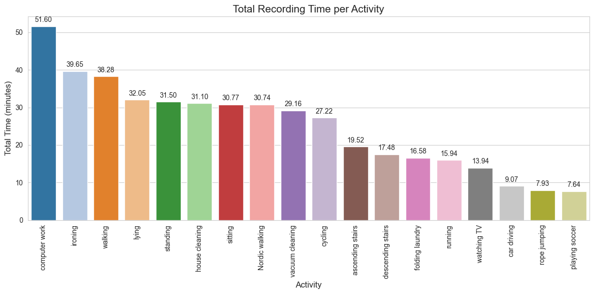
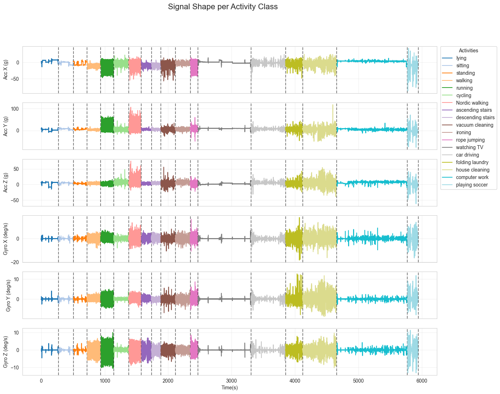
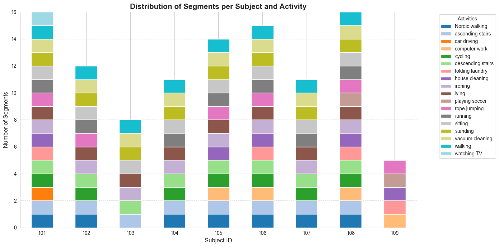
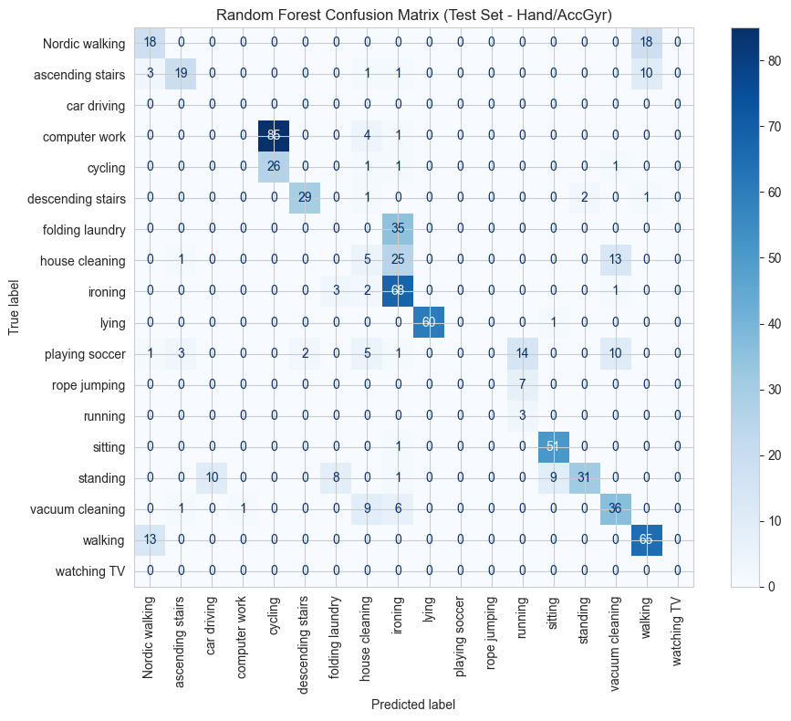
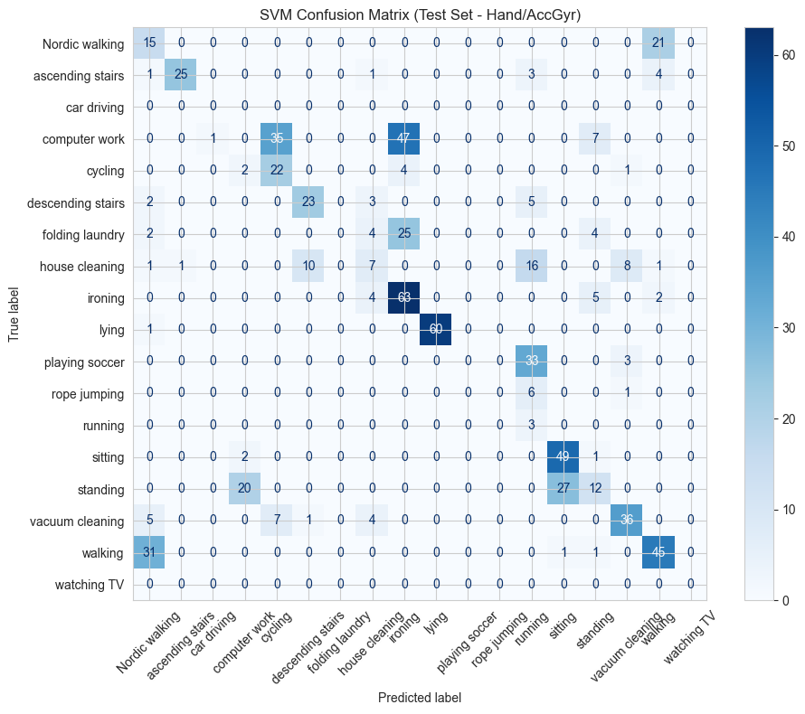
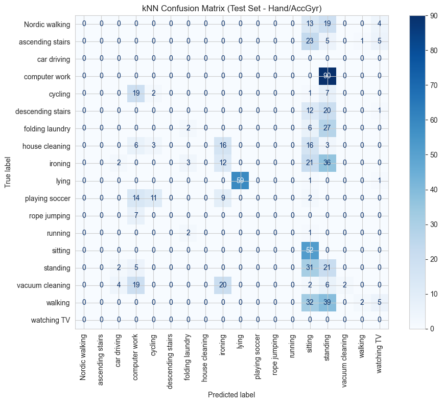
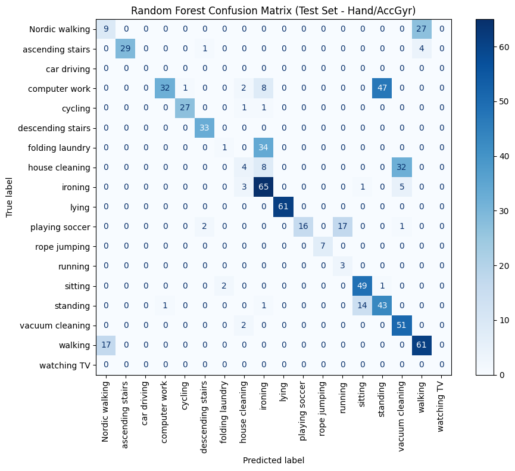
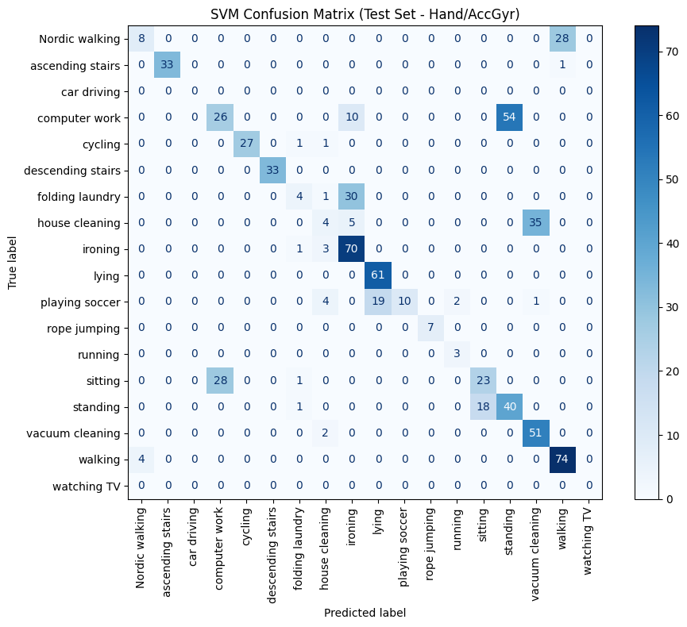

# Project File Structure
The file structure we used for the implementation is as follows:
- **data_ingestion.py:** The script for reading the PAMAP2 dataset and storing the data into the MongoDB collection.
- **aiot_project_time_series.ipynb:** The notebook that implements the pipeline for the ML classification with raw time series windowed data.
- **aiot_project_feature_engineering.ipynb:** The notebook that implements the pipeline for the ML classification using feature set extracted by the time series windowed data.
- **config.yml:** Modified config.yml.template file, that was given in the project sample files, in order to match our requirements for the project.

# Instructions for Code Running
Firstly, data_ingestion.py have to be executed in order to store the data into the MongoDB database.

Then any of the two Jupyter notebooks either aiot_project_time_series.ipynb or aiot_project_feature_engineering can be executed according to which solution is chosen. The cells of either of the two notebooks though, have to be executed with the order that are written. The only step that is not necessary for the ML models training and can be skipped is the EDA part.

The data ingestion process is implemented with data_ingestion.py script and data processing, model training and model evaluation process are implemented with the two notebooks.

# Configurations Used
All possible combinations of IMUs were tested and the results for the accuracy metric of the ML models are listed in the report, as well as an analysis for these results. The IMUs configurations were:
- hand
- anke
- chest
- hand + ankle
- hand + chest
- ankle + chest
- hand + ankle + chest

For the train/test subjects split, they were tested various combinations and kept the one with the highest performance. Some of these combinations were:
- Test subjects = {105, 107, 109} | Train subjects = {101, 102, 103, 104, 106, 108}
- Test subjects = {105, 107, 108} | Train subjects = {101, 102, 103, 104, 106, 109}
- Test subjects = {103, 107, 109} | Train subjects = {101, 102, 104, 105, 106, 108}
- Test subjects = {103, 105, 109} | Train subjects = {101, 102, 104, 106, 107, 108}
- Test subjects = {102, 103, 109} | Train subjects = {101, 104, 105, 106, 107, 108}
- Test subjects = {101, 103, 109} | Train subjects = {102, 104, 105, 106, 107, 108}
- Test subjects = {107, 108}      | Train subjects = {101, 102, 103, 104, 105, 106, 109}
- Test subjects = {103, 109}      | Train subjects = {101, 102, 104, 105, 106, 107, 108}

# Images From EDA and Training Results
We present images from EDA process results as well as the confusion matrices for the time-series and feature engineering solutions for the hand-only IMU configuration. Confusion matrices for the rest of IMUs configurations can be generated with the notebooks code.

## EDA Plots:

## Time Series(Random Forest):

## Time Series(SVM):

## Time Series(kNN):

## Feature Engineering(Random Forest):

## Feature Engineering(SVM):

## Feature Engineering(kNN):
